<div align="center">

# 🛡️ CIH Bank CTI Platform

**A Cyber Threat Intelligence (CTI) and OSINT automation platform for monitoring, collecting, analyzing, and correlating threat data.**

**🌐 Deployment:** Internal / Localhost Environment

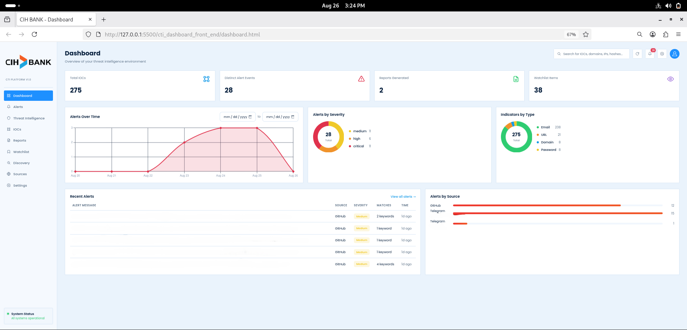

</div>

---

## ✨ Features

* 🎨 **Dark & Light Themes** — Switch between Dark and Light modes. The selected theme is persisted in `localStorage` and applied instantly.
* 🕷️ **OSINT Crawlers** — Automated collection from GitHub, Pastebin, Telegram, X/Twitter, and Tor-based sources.
* 🕵️‍♂️ **Discovery Engine** — Automatically identifies new monitoring targets using dnstwist for typosquatting detection, crt.sh certificate logs, and automated link-following.
* 🧠 **Threat Intelligence Engine** — Scores and classifies alerts into Critical, High, Medium, and Low severity levels using phishing indicators, exposed credentials, and BIN detection.
* 🎯 **Automated IOC Extraction** — Extracts, deduplicates, and correlates Emails, Passwords, IPs, Domains, and URLs from raw collected data.
* 📊 **Analytics & Reports** — Provides real-time visualizations using Chart.js and automated daily intelligence report generation in `.txt` format.
* 📱 **Fully Responsive** — Optimized for desktop, tablet, and mobile devices with custom mobile navigation and no horizontal overflow.
* ⚡ **REST API Gateway** — FastAPI backend handling authentication, data ingestion, business logic, and database interactions.

---

## 🔄 Platform Workflow

```text
┌──────────────────────┐
│    Target Discovery  │
│  dnstwist / crt.sh   │
└──────────┬───────────┘
           ↓
┌──────────────────────┐
│ Watchlist Management │
└──────────┬───────────┘
           ↓
┌──────────────────────┐
│    OSINT Collection  │
│ GitHub / Telegram /  │
│ Pastebin / X / Tor   │
└──────────┬───────────┘
           ↓
┌──────────────────────┐
│    Raw Findings      │
└──────────┬───────────┘
           ↓
┌──────────────────────┐
│ Threat Intelligence  │
│        Engine        │
└──────────┬───────────┘
           ↓
┌──────────────────────┐
│ IOC Extraction &     │
│    Correlation       │
└──────────┬───────────┘
           ↓
┌────────────────────────┐
│ Severity Classification│
│ Critical → Low         │
└──────────┬─────────────┘
           ↓
┌──────────────────────┐
│ Alerts & Intelligence│
│        Reports       │
└──────────┬───────────┘
           ↓
┌──────────────────────┐
│    React Dashboard   │
└──────────────────────┘
```

---

## 🧭 Platform Modules

Here is a breakdown of the core interfaces and what they do:

* **🏠 Dashboard & Login:** Secure JWT-based entry point. The dashboard provides a bird's-eye view of the threat landscape, summarizing total IOCs, active alerts, severity distributions, and crawler activity.

* **🛡️ Threat Intelligence & IOCs:**

  * *Threat Intelligence:* Displays alerts that have been enriched, scored, and classified (Critical to Low) by the engine. Highlights domain reputation (VirusTotal/urlscan.io) and specific phishing/BIN detections.
  * *IOCs (Indicators of Compromise):* A centralized repository of extracted data (Emails, Passwords, IPs, Domains, URLs), seamlessly pairing leaked credentials back to their source alerts.

* **🚨 Alerts & Discovery:**

  * *Alerts:* The raw, unfiltered feed of all keyword matches collected by the live OSINT crawlers across the surface, deep, and dark web.
  * *Discovery:* An analyst review queue for new, auto-discovered targets (typosquatted domains, cross-referenced Telegram channels, linked Tor sites) pending approval for active monitoring.

* **⚙️ Watchlist, Sources & Settings:**

  * *Watchlist:* Manage the exact keywords, domains, and entities the OSINT crawlers actively hunt for.
  * *Sources:* Manage the specific Telegram channels and Tor `.onion` forums the platform is actively scraping.
  * *Settings:* Switch between Dark/Light modes, manage user credentials, and check backend API connectivity.

* **📄 Reports & System:**

  * *Reports:* View auto-generated daily intelligence reports or use the built-in editor to draft and save manual CTI reports.
  * *Backend Terminal:* The command-line view of the FastAPI server powering the entire platform.

---

## 💻 Responsive Design

The platform adapts seamlessly across desktop, tablet, and mobile layouts while maintaining full functionality and chart interactivity.

| 🖥️ Desktop View                                                                           | 📱 Mobile View                                                                             |
| ------------------------------------------------------------------------------------------ | ------------------------------------------------------------------------------------------ |
|  | 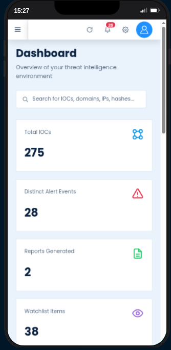 |

---

## 📸 Screenshots

<details open>
<summary><b>🏠 Dashboard & Login</b></summary>

| Desktop                                                                                                     | Mobile                                                                                                                                                                                                                                                                                                                                                                                           |
| ----------------------------------------------------------------------------------------------------------- | ------------------------------------------------------------------------------------------------------------------------------------------------------------------------------------------------------------------------------------------------------------------------------------------------------------------------------------------------------------------------------------------------ |
| **Login**<br>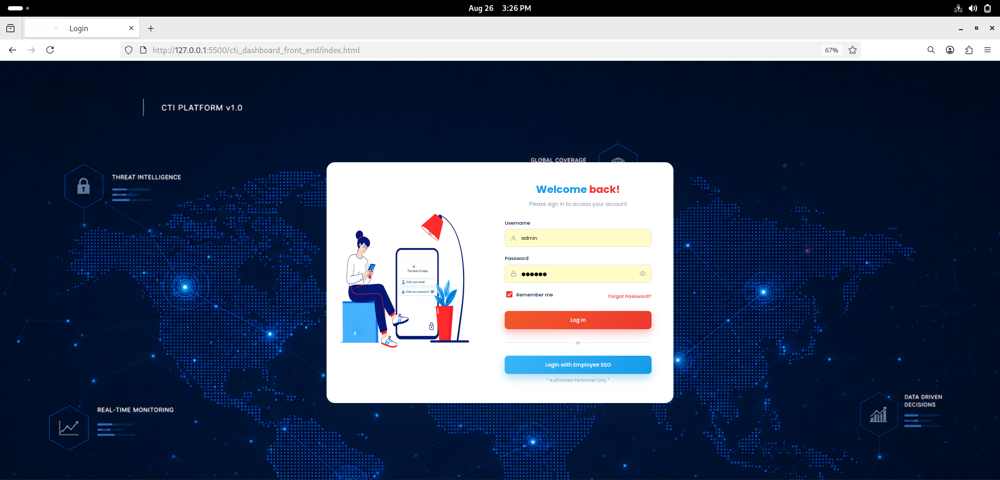              | 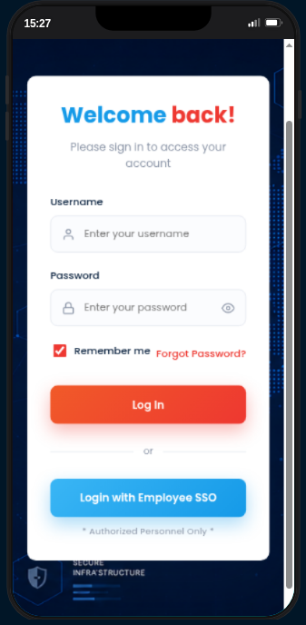                                                                                                                                                                                                                                                                                                                  |
| **Dashboard**<br> | <br><br>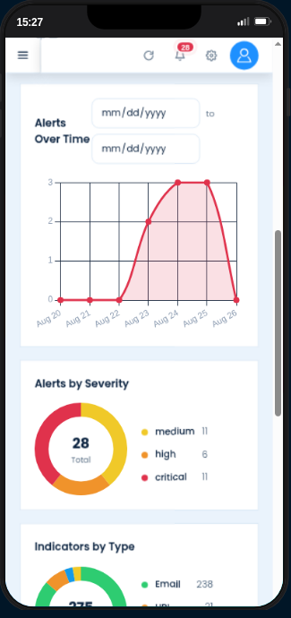<br><br>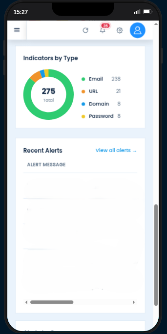<br><br>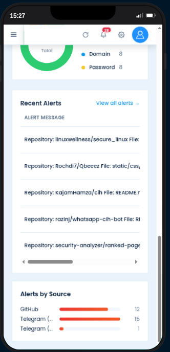 |

</details>

<details>
<summary><b>🛡️ Threat Intelligence & IOCs</b></summary>

| Desktop                                                                                                                    | Mobile                                                                                                                                                                                                                                                                                                        |
| -------------------------------------------------------------------------------------------------------------------------- | ------------------------------------------------------------------------------------------------------------------------------------------------------------------------------------------------------------------------------------------------------------------------------------------------------------- |
| **Threat Intelligence**<br>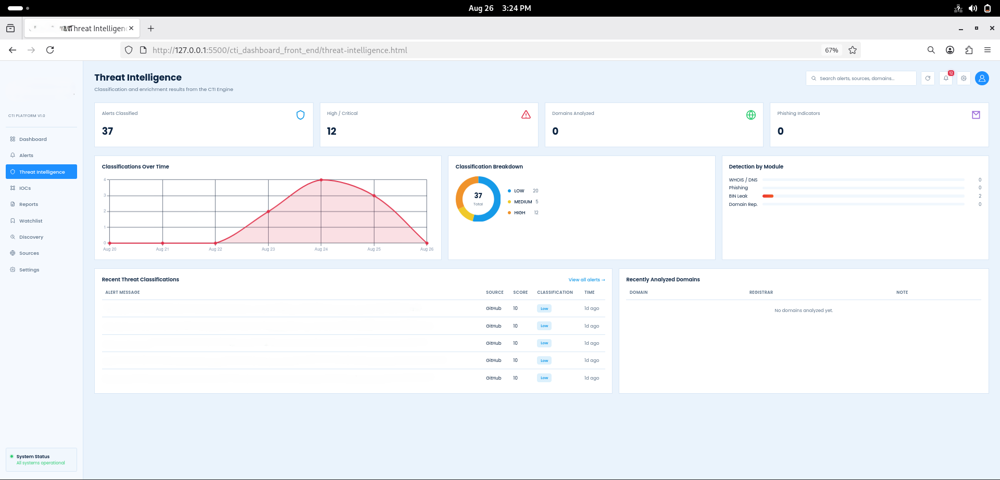 | 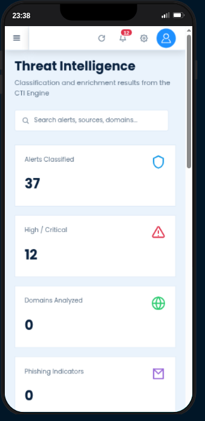<br><br>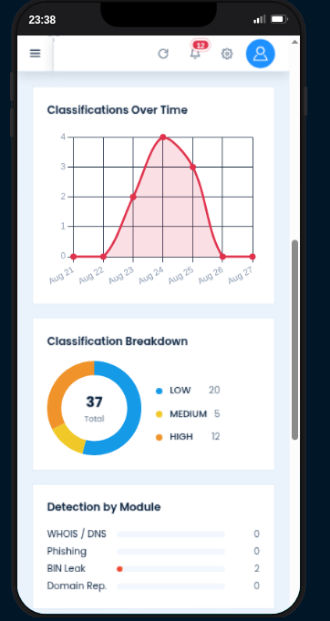<br><br>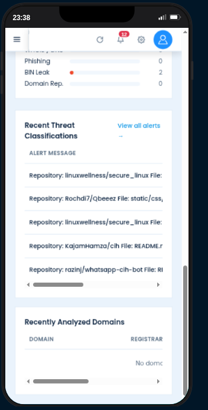 |
| **IOCs**<br>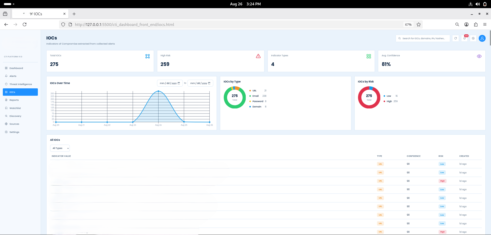                               | 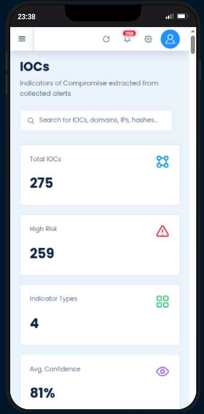<br><br>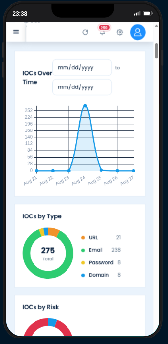<br><br>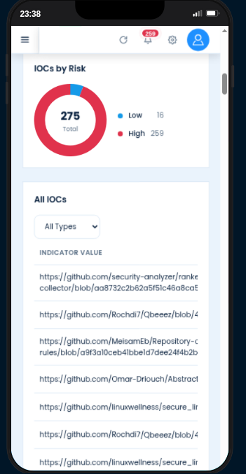                                              |

</details>

<details>
<summary><b>🚨 Alerts & Discovery</b></summary>

| Desktop                                                                                                | Mobile                                                                                                                                                                             |
| ------------------------------------------------------------------------------------------------------ | ---------------------------------------------------------------------------------------------------------------------------------------------------------------------------------- |
| **Alerts**<br>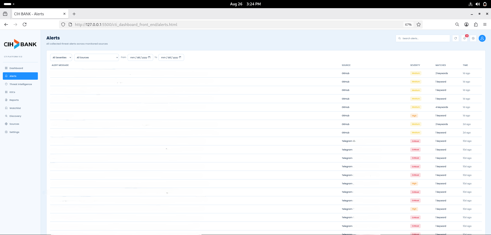       | 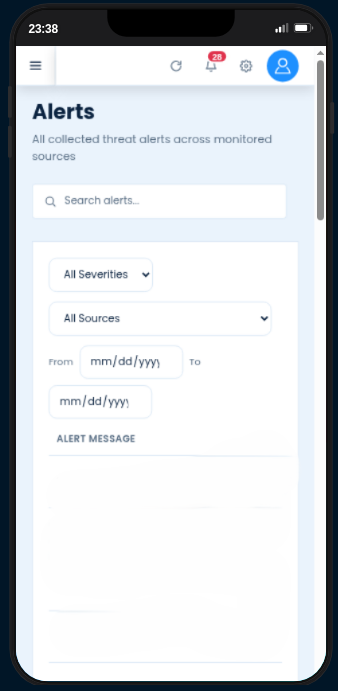                                                                                                   |
| **Discovery**<br>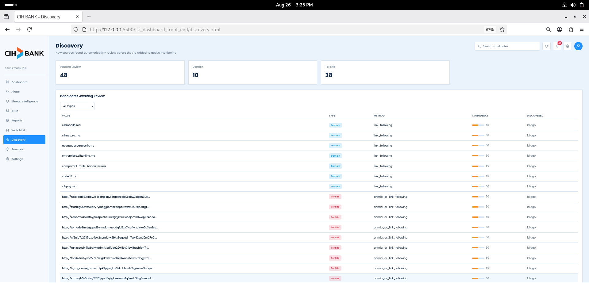 | 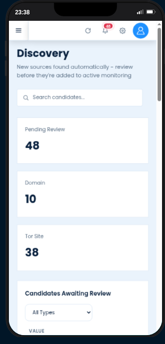<br><br>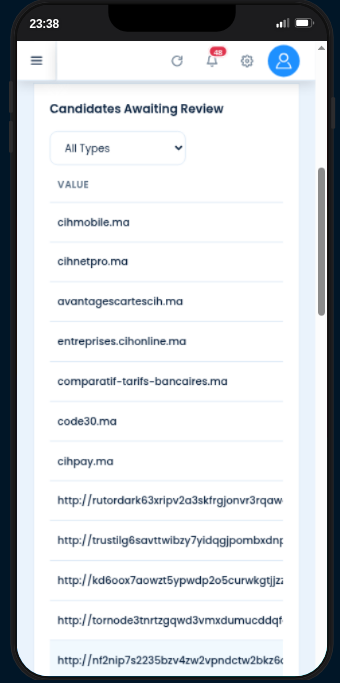 |

</details>

<details>
<summary><b>⚙️ Watchlist, Sources & Settings</b></summary>

| Desktop                                                                                                | Mobile                                                                                                                                                                         |
| ------------------------------------------------------------------------------------------------------ | ------------------------------------------------------------------------------------------------------------------------------------------------------------------------------ |
| **Watchlist**<br>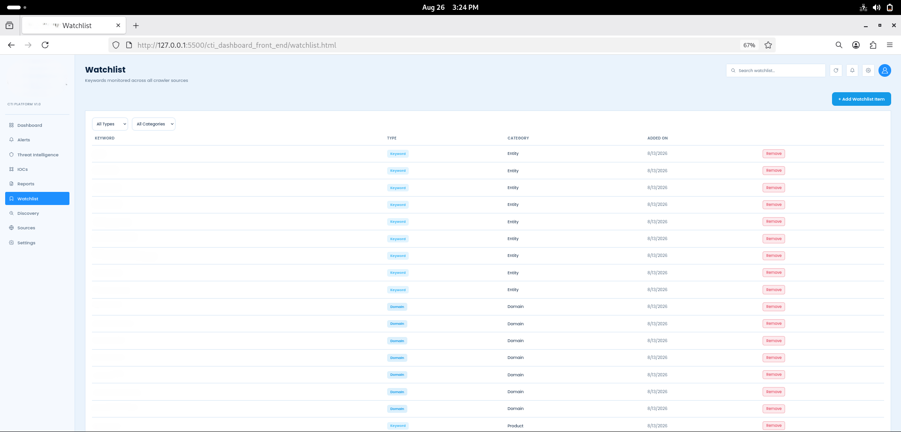 | 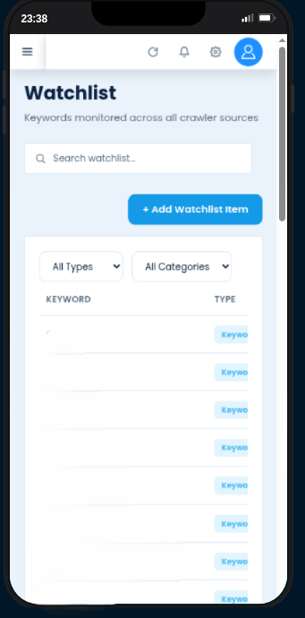                                                                                            |
| **Sources**<br>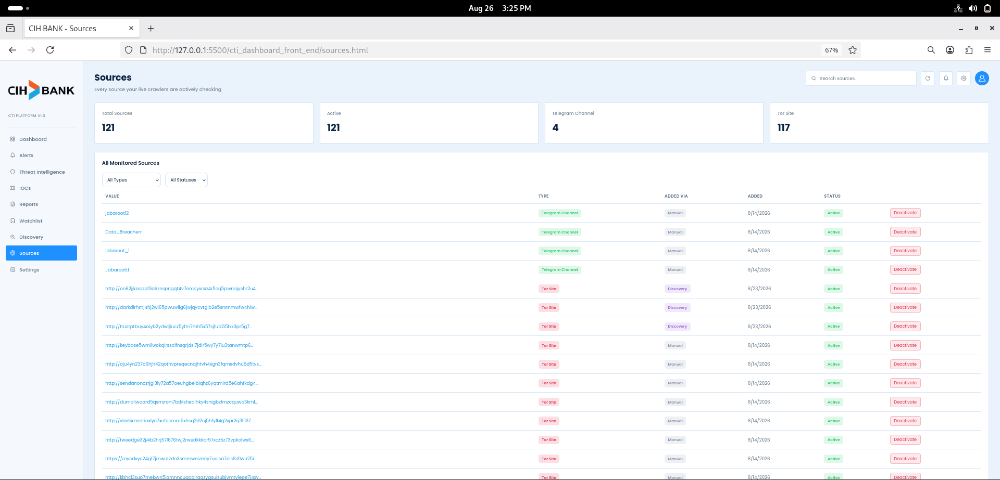     | 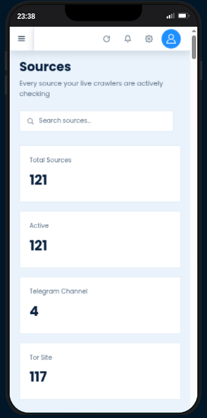<br><br>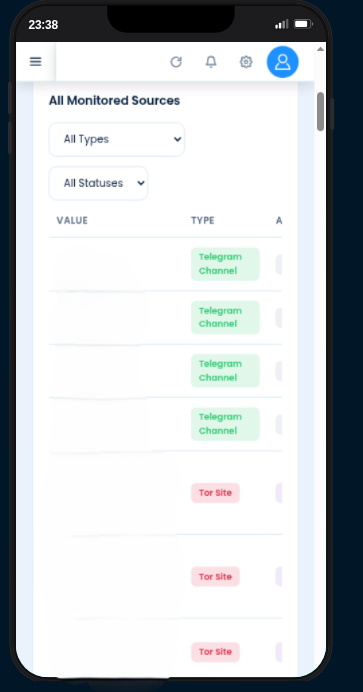 |
| **Settings**<br>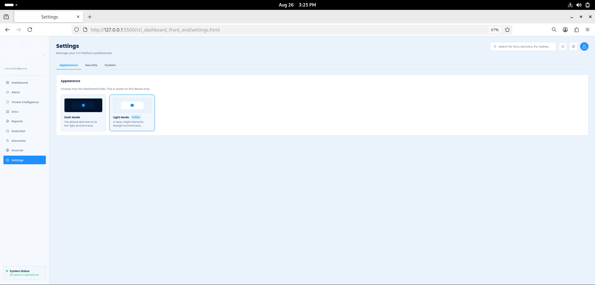   | 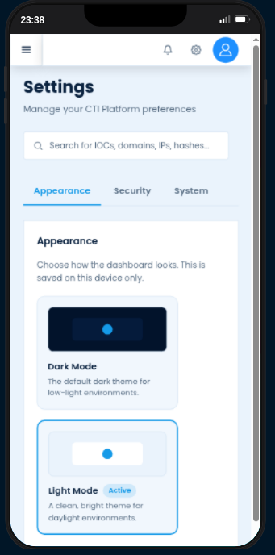                                                                                             |

</details>

<details>
<summary><b>📄 Reports & System</b></summary>

| Desktop / Backend                                                                                                | Mobile                                                                                                                                                                         |
| ---------------------------------------------------------------------------------------------------------------- | ------------------------------------------------------------------------------------------------------------------------------------------------------------------------------ |
| **Reports**<br>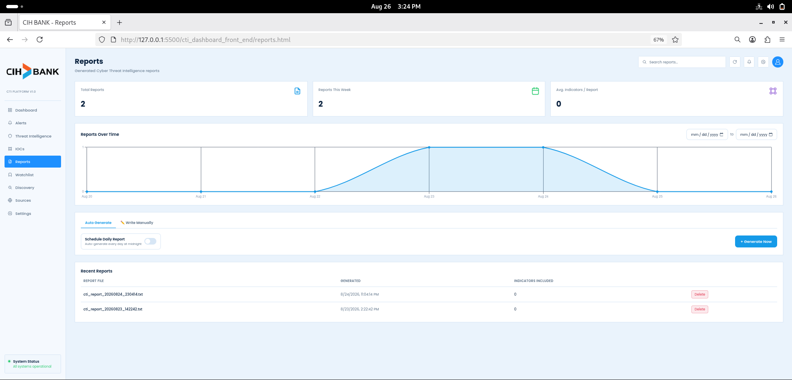               | 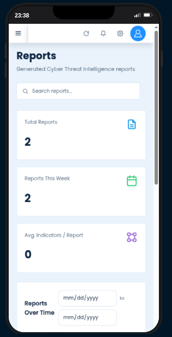<br><br>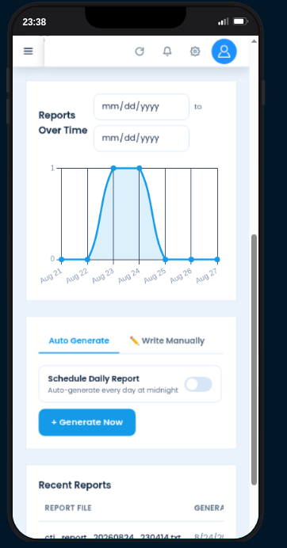 |
| **Backend Terminal**<br>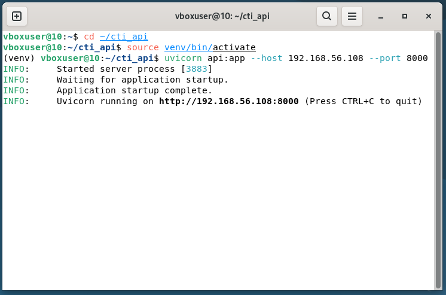 | **Mobile Navigation**<br>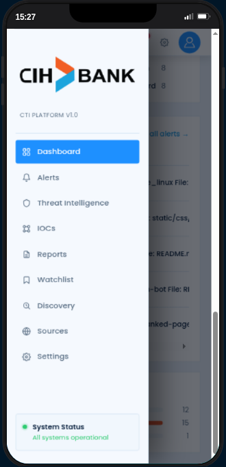                                                             |

</details>

## 🛠️ Tech Stack

| Category                   | Technologies                                           |
| -------------------------- | ------------------------------------------------------ |
| **Frontend UI**            | React 18 (Standalone via Babel), HTML5, CSS3, Chart.js |
| **Backend API**            | FastAPI, Python 3, Uvicorn, JWT Authentication         |
| **Database**               | PostgreSQL, psycopg2                                   |
| **OSINT Crawlers**         | BeautifulSoup4, Telethon, Tweepy, Stem (Tor)           |
| **Discovery & Enrichment** | dnstwist, crt.sh, VirusTotal API, urlscan.io, whois    |
| **Automation**             | Cron jobs (`crontab`)                                  |

---

## 📁 Project Structure

```text
.
Cti-Platform/                
├── LICENSE                    
├── README.md                  
├── docker-compose.yml         #  Infrastructure (FastAPI, Postgres, Tor)
├── backend/
│   └── openapi.json           # Le contrat d'API généré par FastAPI
├── database/
│   └── schema.sql             # Les requêtes CREATE TABLE de l'architecture
└── Images_Summary-Readme/     
```

## 📬 Contact

📧 **Email:** [jaafar.codes@gmail.com](mailto:jaafar.codes@gmail.com)

💼 **LinkedIn:** [Jaafar Trabelsi](https://www.linkedin.com/in/jaafar-trabelsi-557761217/)

🐙 **GitHub:** [@Jaafar-Trabelsi](https://github.com/Jaafar-Trabelsi)

📍 **Location:** Rabat, Morocco

---

© 2026 Jaafar Trabelsi. All rights reserved.

**Open to internships, collaborative projects, and cybersecurity missions.**
